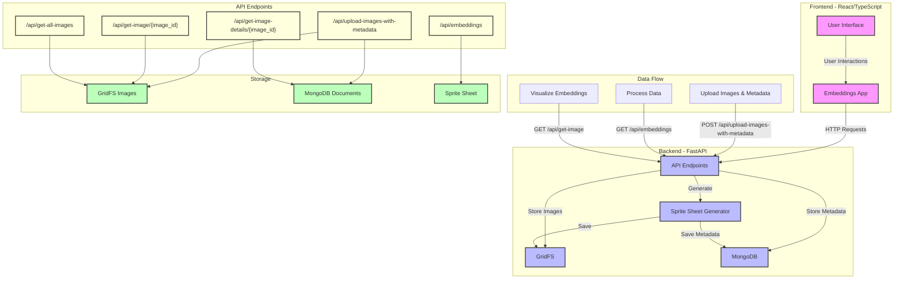

# visualizer-bke

## Extracting data from datafed
### If you have data locally you can copy the folder path and use it later for generating embedding
### Else you extract from datafed using 
- - adjust env according to your datafed configuration
- - **Must have a globus container running**
- - if you dont have globus container running you can checkout this 
- - then run the following 
```bash
python datafed_extractor.py
``` 

## Initialize docker container for mongoDb by 
```bash
docker run --name mongodb \
  -p 27017:27017 \
  --restart unless-stopped \
  -d mongodb/mongodb-community-server:latest


## Install python dependencies 
```bash
pip install -r requirements.txt
```

## Run the backend server locally 
```bash
python app.py
```


## Docker Setup

### Running Environment

To run the application in development mode:

1. Clone the repository
2. Navigate to the project directory
3. Run:

```bash
docker-compose -f docker-compose.yml up --build
```

This will:
- Mount the local code directory into the container for hot-reloading
- Run with the debug mode enabled
- Use non-authenticated MongoDB instance


## Once app is running
Running this api's in a sequence

- To load/upload data with folder path of metadata and images
```bash
/api/upload-images
```
- Followed by this run the following api with method as UMap and TSNE
```bash
/api/make_reduction/{method}
```

Later everything will be handled in UI.